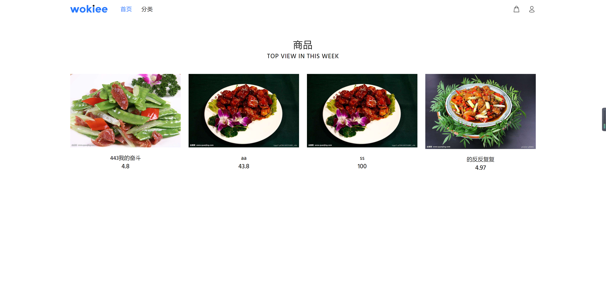
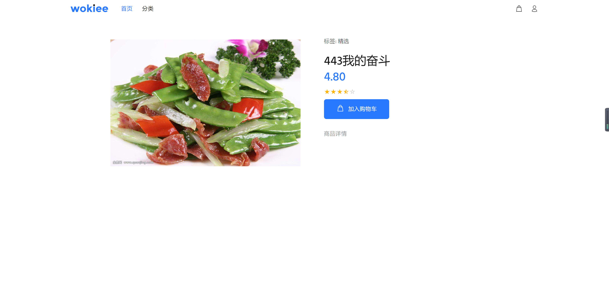
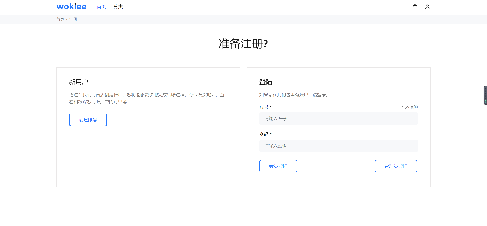
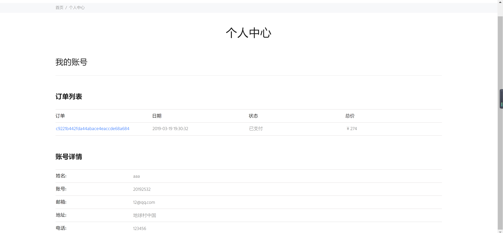
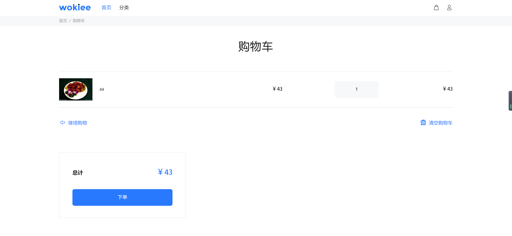
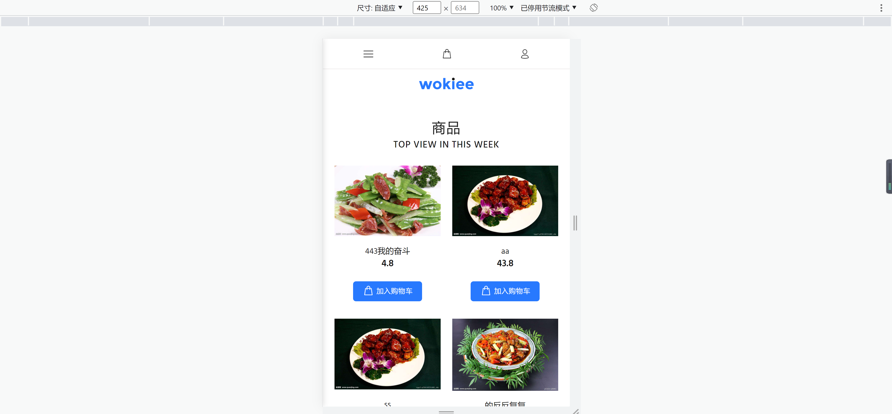
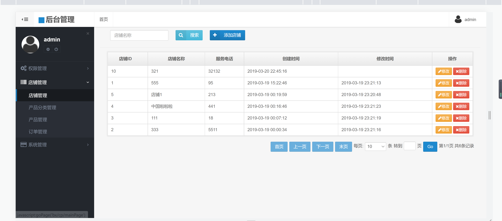
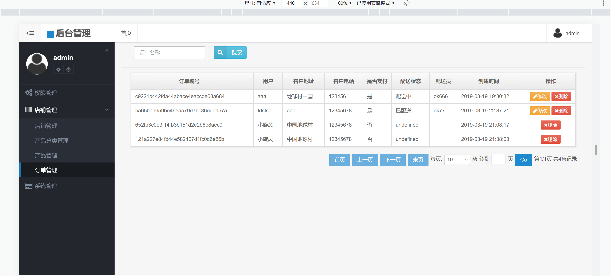

<h1 align="center">手机点餐管理系统</h1>

## 简介
手机点餐管理系统：角色分为管理员、用户；功能包括订单管理、购物车管理、用户信息管理、店铺管理和商品浏览。界面简洁明了，提升用户体验和点餐效率。    --计算机毕业设计源码；毕设源码；java毕业设计源码

## 联系方式

<h3 align="center">获取完整代码与数据库文件 + 微信：deepguan QQ: 86050149 QQ群: 783742310</h3>

<h3 align="center">可帮忙远程部署 包运行成功！提供远程部署、修改代码、设计文档指导、代码讲解等服务！</h3>

## 功能介绍（完整见运行截图）
管理员： 基本功能：管理员可以登录和注册。系统管理：可以管理店铺、产品分类、产品、订单和权限。订单管理：查看和编辑订单详情，包括订单编号、用户、付款状态和配送信息；支持搜索和分页。店铺管理：编辑店铺信息，查看店铺列表，搜索和添加新店铺。   
用户： 基本功能：用户可以注册、登录并管理个人资料。个人中心：查看和编辑个人信息，查看订单列表及其详情。购物功能：浏览一周热门商品，查看商品详情，加入购物车，结算与下单。首页界面：通过导航访问主页、分类和个人账户，查看热门商品和评分，方便点餐。

## 运行截图

本代码来源于网络,仅供学习参考使用!

